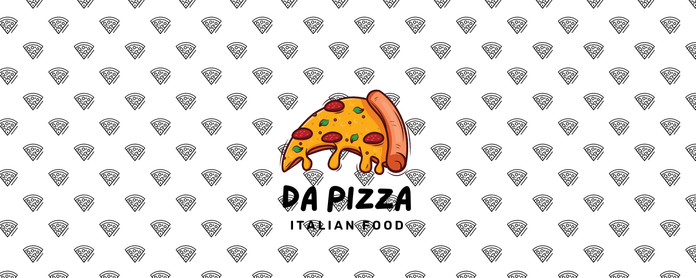

<h1>Projeto: Da Pizza</h1>
 
 

**Devs:**
- <a href="https://github.com/gabryel-araujo" target="_blank">Gabryel Araújo</a>
- <a href="https://github.com/Filipe-Rds" target="_blank">Filipe Rodrigues</a>
- <a href="https://github.com/Nillocoelho" target="_blank">Danillo Coelho</a>

**Objetivo:**
 
- Construir um site que simule uma pizzaria com auxílio de linguagens de programação. 

**Tecnologias utilizadas:**

  
  
  
  
  

